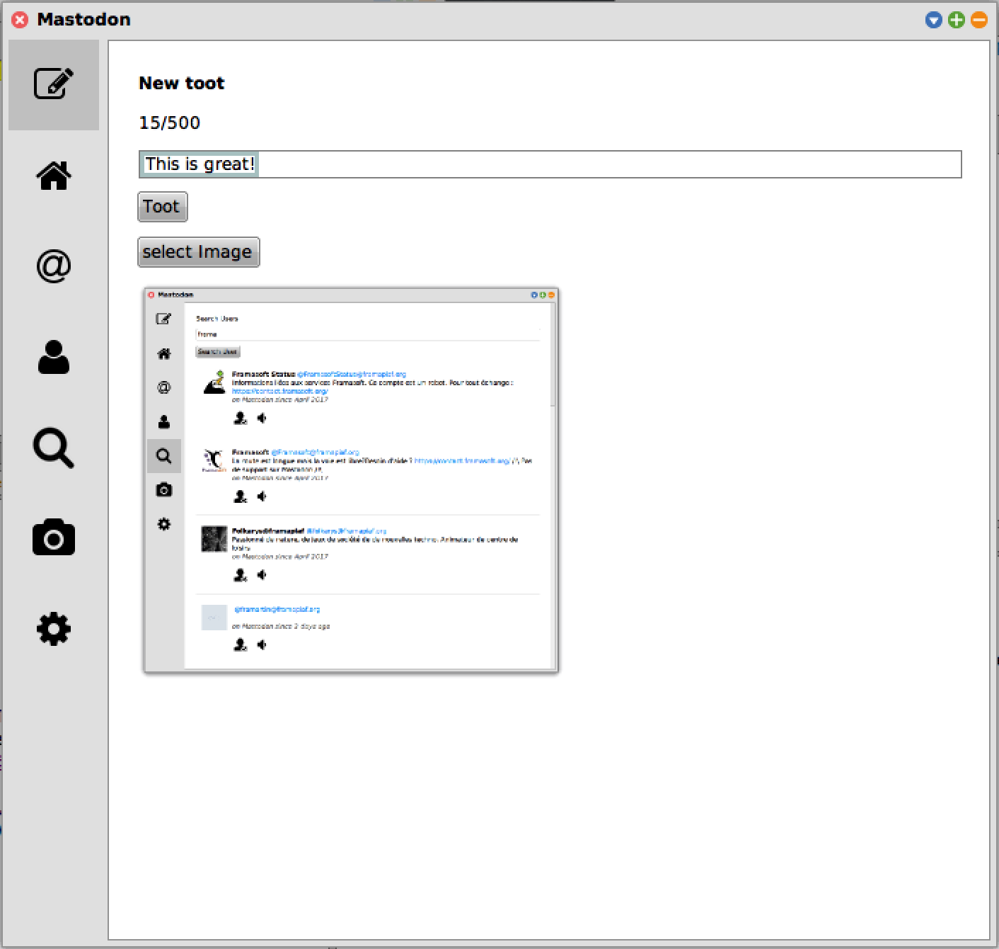
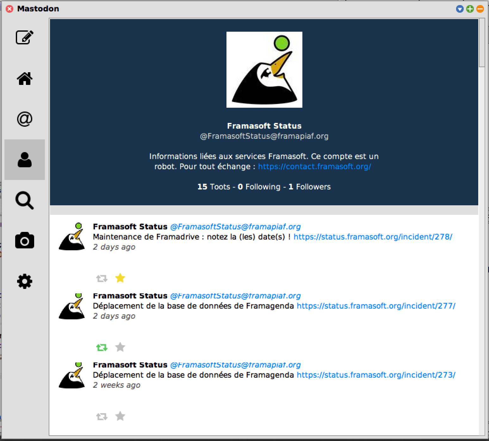

# SWT17-Project-15 [](https://travis-ci.org/hpi-swa-teaching/SWT17-Project-15)[](https://ci.appveyor.com/project/DonMoritzio/swt17-project-15)

# Squeak Mastodon Client

A full-featured Smalltalk/Squeak desktop client for Mastodon and BlueSky - decentralized social media alternatives.

<div align="center">
  
  
  
</div>

## Overview

This project provides a native Squeak/Smalltalk client for interacting with Mastodon and BlueSky social networks. It offers a modern graphical interface with support for reading timelines, composing posts, searching, managing accounts, and more - all from within the Squeak environment.

## Project Structure

```
Squeak-Mastodon/
├── BaselineOfMastodon.package/     # Build configuration and dependencies
├── Mastodon-Core.package/          # Main application code
│   ├── MTAccount.class             # Account management
│   ├── MTMastodonApi.class         # Mastodon API client
│   ├── MTBlueSkyApi.class          # BlueSky API client
│   ├── MTMastodonModel.class       # Core data models
│   ├── MTToot.class                # Post model
│   ├── MTUIWindow.class            # Main UI window
│   ├── MTUINewToot.class           # Compose post UI
│   ├── MTUIProfile.class           # User profile UI
│   ├── MTUISettings.class          # Settings UI
│   ├── MTUISearch.class            # Search UI
│   └── [Other UI components]       # Various UI classes
├── Mastodon-Tests.package/         # Unit tests
│   ├── MTMastodonApiTest.class
│   ├── MTBlueSkyApiTest.class
│   ├── MTAccountStoreTest.class
│   └── [Other tests]
├── Mastodon-Spike-Twitter.package/ # Twitter integration spike
├── screenshots/                    # Documentation screenshots
└── README.md                       # This file
```

## Getting Started

### Prerequisites

- **Squeak/Smalltalk**: A working Squeak installation (version compatible with the project's baseline)
- **Network Access**: Internet connection for API calls to Mastodon and BlueSky instances

### Installation

1. **Clone or Download** this repository:

   ```bash
   git clone https://github.com/hpi-swa-teaching/squeak-mastodon.git
   cd squeak-mastodon
   ```

2. **Load in Squeak** using the baseline:
   - Open Squeak
   - Open the Package Manager (Monticello)
   - Add a repository pointing to this directory
   - Load the `BaselineOfMastodon` package and all dependencies

3. **Via Metacello** (if your Squeak supports it):
   ```smalltalk
   Metacello new
     baseline: 'Mastodon';
     repository: 'github://hpi-swa-teaching/squeak-mastodon/repository';
     load.
   ```

### Quick Start

After loading the package:

1. **Launch the Application**:

   ```smalltalk
   MTUIWindow openNewWindow.
   ```

2. **Login to Mastodon**:
   - Click the login button
   - Enter your Mastodon instance URL (e.g., `mastodon.social`)
   - Authorize the application

3. **Start Using**:
   - View your home timeline
   - Compose new posts
   - Search for content and users
   - Manage your accounts in settings

## Architecture

### Layered Design

- **API Layer**: `MTMastodonApi` and `MTBlueSkyApi` - Handle network communication and protocol details
- **Model Layer**: `MTToot`, `MTAccount`, `MTMastodonModel` - Core data structures
- **Service Layer**: `MTAccountStore`, `MTSettingsStore`, `MTImageCache` - Business logic and persistence
- **UI Layer**: `MTUIWindow`, `MTUINewToot`, `MTUIProfile`, etc. - Graphical interface components
- **Utilities**: `MTUtils`, `MTUrl`, `MTError` - Helper functions and error handling

### Provider Pattern

The project uses an extensible provider pattern (`MTProviderFactory`, `MTSocialProvider`) to support multiple social networks. This allows easy addition of new providers (Twitter support is included as a spike).

## Dependencies

- **Widgets**: HPI-SAG Squeak Widgets library for UI components
  - Repository: `github://hpi-swa/widgets`

## Features in Detail

### Account Management (`MTAccount`, `MTAccountStore`)

- Store and manage login credentials
- Switch between multiple accounts
- Manage follower/following relationships
- Track account statistics

### API Integration

- **Mastodon API**: Full REST API support via `MTMastodonApi`
- **BlueSky API**: Protocol support via `MTBlueSkyApi`
- Automatic request/response handling
- Rate limiting awareness

### UI Components

- Custom scroll bars and panes (`MTUIScrollBar`, `MTUIScrollPane`)
- Rich text formatting (`MTUITextFormatter`, `MTUITextMorph`)
- Dynamic action buttons (`MTUIActionButton`, `MTUIFollowButton`, `MTUILikeButton`)
- Efficient list rendering (`MTUITootList`)
- Profile and timeline views (`MTUIProfile`, `MTUIUserTimeline`, `MTUIHomeTimeline`)

### Media Management

- Image caching system (`MTImageCache`)
- Screenshot support (`MTScreenshot`)
- Media model with metadata (`MTMedia`)

## Configuration

### Settings

User preferences are managed in `MTUISettings` and persisted via `MTSettingsStore`:

- Text editor preferences
- Display settings
- Account preferences
- Cache preferences

### Credentials

Login credentials are handled securely via `MTLoginCredentials` with support for:

- OAuth tokens
- Instance URLs
- Account preferences

## Known Limitations & Future Work

- Twitter integration is currently a spike/prototype
- Some BlueSky features may be incomplete
- UI could benefit from additional customization options
- Performance optimization for large timelines

---

## Support

For issues, questions, or suggestions:

- Check existing GitHub issues
- Review the code and test files for examples
- Check the screenshots for feature demonstrations

## License

This project is licensed under the **MIT License** - see the [LICENSE](LICENSE) file for details.

Copyright (c) 2017 Software Architecture Group Teaching (HPI)

---
