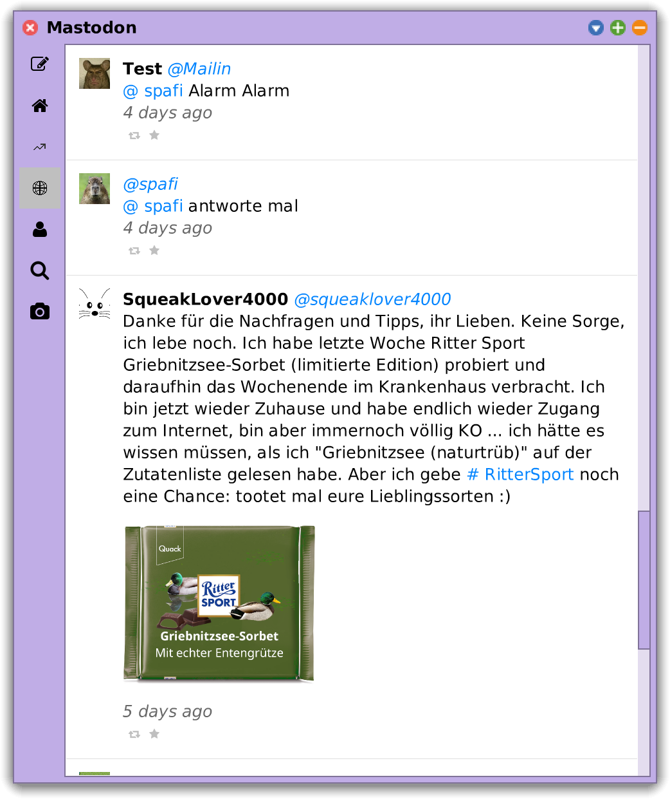
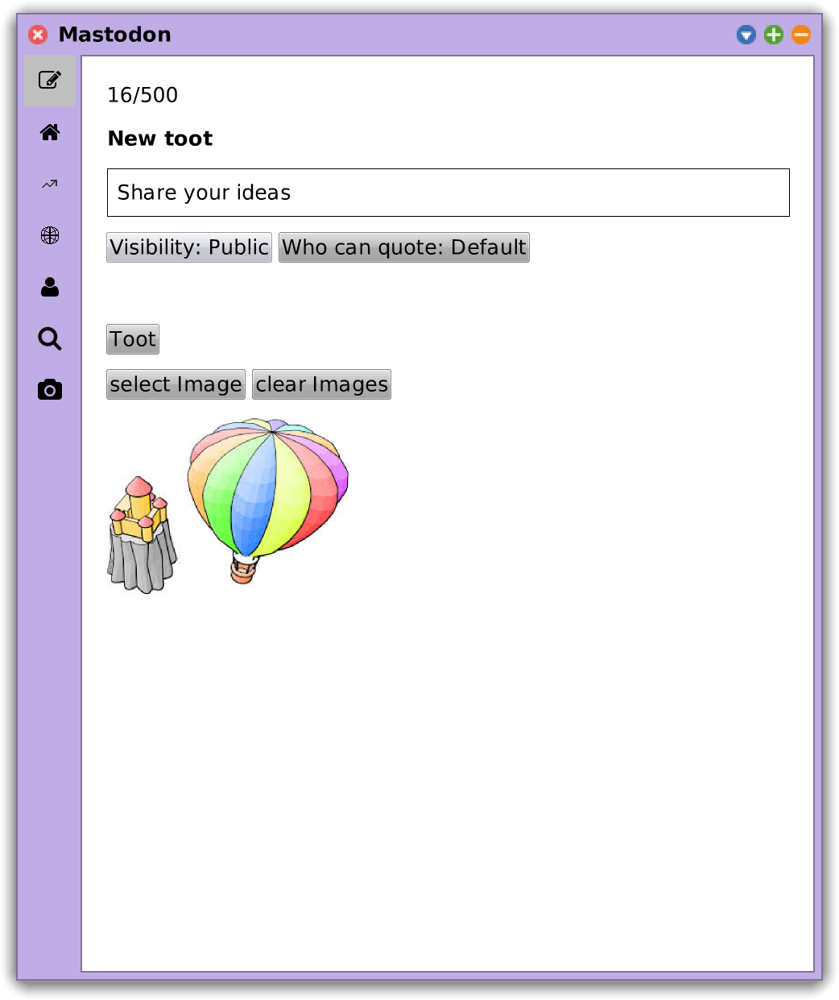
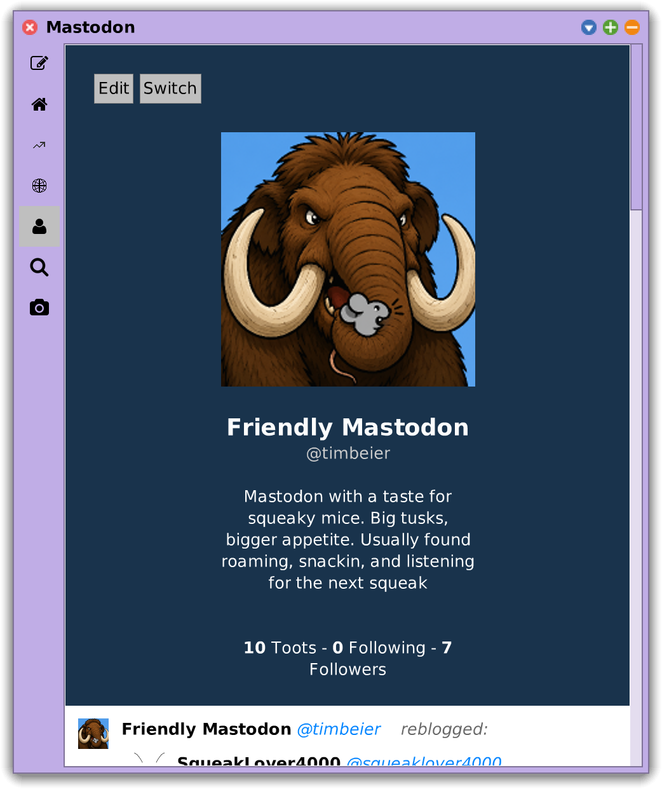
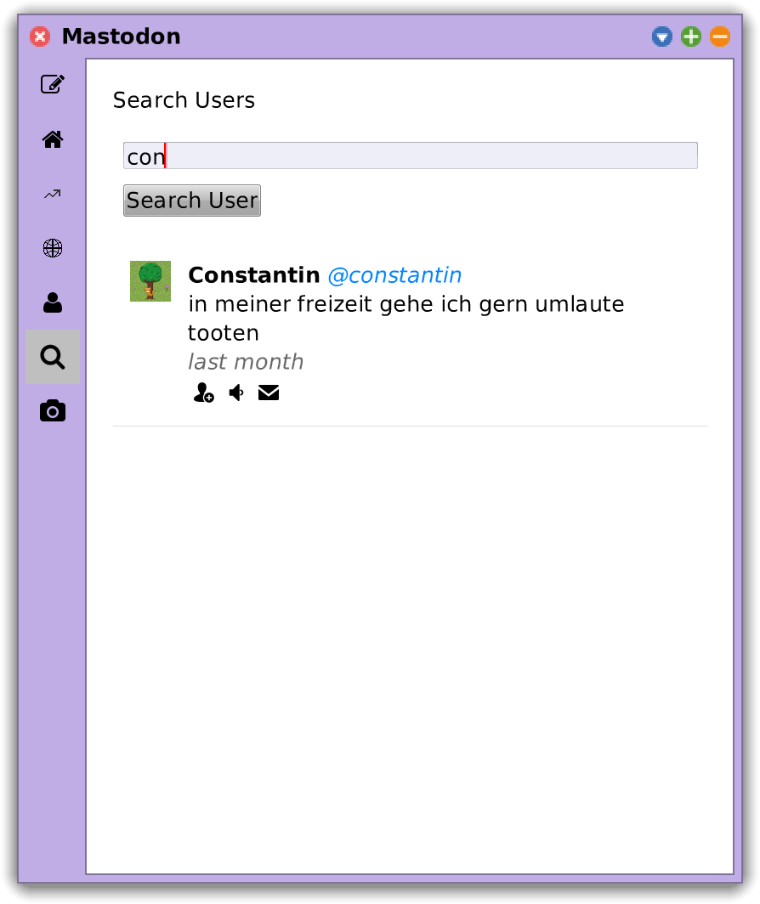

# SqueakMastodon

> A native Mastodon client for Squeak.

Originally created in **2017** as part of the *Software Engineering (SWE)* course at the **[Hasso Plattner Institute](https://hpi.de)**, this project was revisited, modernized, and extended by a new student team in **2026**.

## Overview

SqueakMastodon is a graphical Mastodon client implemented entirely in Squeak. It provides a native Morphic interface for interacting with Mastodon instances through the official API.

## Features
- Login to any Mastodon instance
- Browse home, trending and live timelines
- Compose and publish toots with images
- View user profiles and individual toots
- Search for users
- Interact with other users and toots
- Switch between accounts
- Edit profile information

## Screenshots





## Installation

### Prerequisites

- Squeak 6.x (or newer)
- Squeak Git Browser
- A Mastodon account

### 1. Make sure [Metacello](https://github.com/Metacello/metacello) is installed

If you're using Squeak, it most likely is.

### 2. Load SqueakMastodon

Evaluate the following expression in a Workspace:

```smalltalk
Metacello new
    baseline: 'Mastodon';
    repository: 'github://hpi-swa-teaching/Squeak-Mastodon:swt26-g11\/main';
    load.
```

### 3. Start the application

Evaluate:

```smalltalk
MTUIWindow open
```

### 4. Have fun

Login into your favorite Mastodon instance and start tooting!

## License

This project is licensed under the MIT License. See the [LICENSE](LICENSE) file for details.
